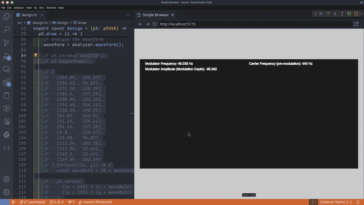

# Create P5 Project

## Introduction

An npm / npx starter template for P5 projects using Typescript and Hot Reload preview. This tool simplifies the process of setting up a p5.js project, allowing you to focus on creating fully parametric 2D drawings, 2D animations, and fully interactive vector-based experiences in the browser with ease.



## Features

- 🚀 **Easy Setup**: Initialize your P5 project with a single command.
- 💻 **TypeScript Support**: Leverage the power of TypeScript for more robust code.
- 🔁 **Hot Reload Preview**: Instantly view changes in your design as you code.
- 📁 **Automated Structure and Dependency Management**: Automatically creates the necessary folder structure and installs dependencies.
- 🎨 **Focus on Design**: Spend more time designing and less on setup.
- 🛠️ **Integrated VSCode Experience**: Recommended extensions and launch configurations for a seamless development experience.
- 📤 **SVG Export Option**: Export your designs SVG format.

## Like this project? ❤

Please consider:

- [Buying me a coffee](https://ko-fi.com/jeanlescure) ☕
- Supporting me on [Patreon](https://www.patreon.com/jeanlescure) 🏆
- Starring this repo on [Github](https://github.com/simplyhexagonal/create-p5-project) 🌟

## Getting Started

### Prerequisites

Ensure you have Node.js installed on your system to use `npm` or `npx`.

### Installation

To create a new P5 project, run the following command in your terminal:

```bash
npm init p5-project <your-project-name>
```

or

```bash
npx create-p5-project <your-project-name>
```

This command will create a new directory with your project name, set up the folder structure, and install all the necessary dependencies.

### Templates

To use a specific template, pass the `--template` argument when creating a new project. For example:

```bash
npm init p5-project <your-project-name> -- --template=screw-and-nut
```

To list available templates you can run:

```bash
npx create-p5-project --list-templates
```

There are currently three templates available:

- `default`: A blank canvas for whatever project you're working on.
- `svg-export`: Contains a screw and nut for you to play with.
- `sound`: Contains a screw and nut for you to play with.

More templates will be added soon, hopefully by contributors too!

### VSCode Integration

- **Recommended Extensions**: The generated `.vscode` directory contains recommendations for helpful extensions. Please review and install them to enhance your development experience.
- **Launch Configuration**: Use the "Launch P5" configuration in the `Run and Debug` section of VSCode. This will open the `design.ts` file, run `npm run dev`, and open the preview browser. 
  - **Note**: The first time you run this, the preview browser may initially display a white screen. Please wait until the debug output indicates that it's safe to reload the simple browser panel.

### Alternatively - Development in other IDEs

If you are **NOT** using VSCode, or if you'd rather run the dev environment manually, then, after setting up your project, navigate to your project directory and start the development server:

```bash
cd <your-project-name>
npm run dev
```

### Preview and Export

- The project uses Vite to provide a hot reload dev server to be able to preview changes to the design any time you save.
- To export to SVG, you can set the `renderSvg` variable to `true` and serialize the SVG html element for download. For an example you can use the `svg-export` template.

## Related Projects and Resources

`create-p5-project` is built upon and inspired by the capabilities of `p5.js`. Here are some resources and related projects that can enhance your experience with `p5.js`:

- **p5.js**: The core framework upon which this project is based. For more information and documentation, visit [P5's website](https://p5js.org/).

- **p5.js Cheat Sheet**: A handy guide for quick reference to P5 syntax and features. Perfect for beginners and experienced users alike. Check out the [P5 Cheat Sheet by Andreas Metz](https://sqrlycode.com/p5-js-cheatsheet/).

- **Using p5.js & React to fill a Canvas**: Dive into a practical example of integrating p5.js with React for creative coding in this informative talk by Monica Powell. Watch the [Using p5.js & React to fill a Canvas](https://www.youtube.com/watch?v=7dCoz56Pucw) video for insights and inspiration.

- **Processing**: The Processing software is used by thousands of visual designers, artists, and architects to create their works. It is the parent project of p5.js. For more information and documentation, visit the [Processing website](https://processing.org/).

## Contributing

Contributions are welcome! Feel free to submit pull requests or open issues to improve `create-p5-project`.

## Contributors

<table>
  <tr>
    <td align="center">
      <a href="https://github.com/jeanlescure">
        
      </a>
    </td>
  </tr>
</table>

## License

This project is licensed under the [Apache-2.0]([LICENSE](https://www.apache.org/licenses/LICENSE-2.0)).

Happy Designing with `create-p5-project`!
